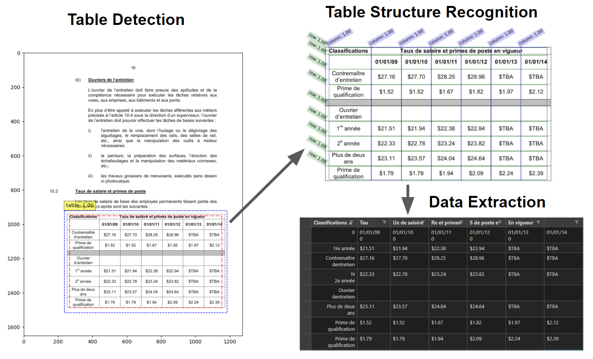

# README.md
<!--Report of this project is originally posted in 
[Medium](https://johnfengphd.medium.com/table-extraction-with-pre-trained-ml-model-f638dfd4bdb7).  If you have the project hosted somewhere, include the link here. -->

<!--  -->
Current URL for app &rarr; https://table-extractor-johnnykfeng.streamlit.app/  
Report of this project can be found here &rarr; https://johnnykfeng.github.io/Table-extraction/  
Public Github repo &rarr; https://github.com/johnnykfeng/Table-Extractor-app  
Video Demo &rarr; [Loom](https://www.loom.com/share/972141aade75425b97fd547f3c65e91b)

## How-to-use
There are 3 sliders to adjust the parameters inside the ML model. For the most of the time the default settings don't need to be changed. If adjustments to the model must be made, here are some guidelines.
- **TD threshold:** Increase if it falsely labels parts that are not tables. Decrease if some tables are missed by the ML model.
- **TSR threshold:** Increase if too many rows/columns are found. Decrease if some rows/columns are not identified properly.
- **Crop padding:** Increase if the edges of the table are cutoff. Decrease if unwanted text outside of the table is captured.
- **First row header:** Check box to designate the first row to be header i.e. column names. Otherwise, column names will be numbered starting at 0.

You can play around with these sliders using pre-loaded samples that you can select from the dropdown menu. Upload your own image by drag and drop or browsing through your local computer. At the moment, it can only take image files such as png or jpg. Click on the `Run table extractor` button to start the process.

Go to **Download csv** page on the left sidebar to download extracted data.

Hope you enjoy the app :)

## Background

Table extraction from documents using machine learning involves training algorithms to automatically identify and extract tables from a given document. This process can be challenging, as tables can come in various formats and layouts, and may be embedded within larger documents such as research papers, reports, or financial statements. The successful implementation of ML-based table extraction can save significant time and resources compared to manual extraction methods, especially for large or complex documents with multiple tables. However, the accuracy of table extraction can be affected by factors such as the quality and consistency of input data, as well as the complexity of the document layout.

A very accurate model has been developed by a team at Microsoft [1]. They trained their DETR (End-to-end Object Detection with Transformers) -based model on a very large dataset of approximately 1 million annotated tables. The original tables were scraped from the PubMed Central Open Access (PMCAO) database. The Microsoft team also formulated their own scoring criteria, Grid Table Similarity (GriTS), for assessing the accuracy of their model [2].

## Project Status
`2023-03-07` - Python script version published on [github](https://github.com/johnnykfeng/sigtica-table-extraction)  
`2023-03-25` - A streamlit app has been built around this work. The first prototype of app has been deployed.  
`2023-05-01` - My Google API has been restricted, app is down   
`2023-05-15` - Fixed the problem, re-deployed app with new URL   

## Future developments:
- Develop multiple table extraction capabilities through parallel processes
- Incorporate PDF files and multiple page extraction
- Implement header structures automatically for more complex tables
- Further training the model via transfer learning to improve performance on hard cases

## Resources
- This project is made possible with https://github.com/microsoft/table-transformer
- Hugging face for making it accessible https://huggingface.co/docs/transformers/model_doc/table-transformer

## References
[1] ["PubTables-1M: Towards comprehensive table extraction from unstructured documents"](https://openaccess.thecvf.com/content/CVPR2022/html/Smock_PubTables-1M_Towards_Comprehensive_Table_Extraction_From_Unstructured_Documents_CVPR_2022_paper.html).  
[2] ["GriTS: Grid table similarity metric for table structure recognition"](https://arxiv.org/abs/2203.12555)  
[3] ["Aligning benchmark datasets for table structure recognition"](https://arxiv.org/abs/2303.00716)

## Contact
Created by John Feng.  
Feel free to contact me at johnfengphd@gmail.com.  
My website [https://johnnykfeng.github.io/](https://johnnykfeng.github.io/)

<!-- Optional -->
<!-- ## License -->
<!-- This project is open source and available under the [... License](). -->

<!-- You don't have to include all sections - just the one's relevant to your project -->